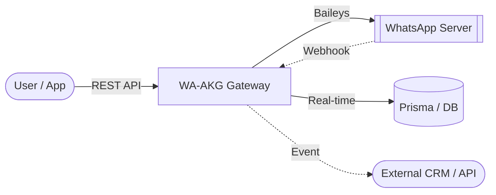

<div align="center">

# 🚀 WA-AKG: The Ultimate WhatsApp Gateway & Dashboard

[](https://wa.me/)
[](https://nextjs.org/)
[](https://www.typescriptlang.org/)
[](https://www.prisma.io/)
[](https://github.com/vinsaeroy/WA-AKG/releases)
[](https://github.com/vinsaeroy/WA-AKG)

**A professional, multi-session WhatsApp Gateway, Dashboard, and Automation System.**  
Built with **Next.js 15**, **React**, and **Baileys** for high-performance messaging automation and real-time WhatsApp Bot Gateway services.

> [!TIP]
> **Looking for the latest features?** Check out the [beta branch](https://github.com/vinsaeroy/WA-AKG/tree/beta) or our [pre-releases](https://github.com/vinsaeroy/WA-AKG/releases) for experimental sources.

[Features](#-key-features) • [User Guide](docs/USER_GUIDE.md) • [API Documentation](docs/API_DOCUMENTATION.md) • [Database Setup](docs/DATABASE_SETUP.md) • [Installation](#-quick-installation)

</div>

---

## 📖 Complete Documentation

WA-AKG comes with extensive documentation designed for both developers and users.

- **[Master Project Documentation](docs/PROJECT_DOCUMENTATION.md)**: Architecture, database, and logic flow.
- **[API Documentation](docs/API_DOCUMENTATION.md)**: Comprehensive OpenAPI / Swagger guide for all **109+ endpoints**.
- **[API Quick Reference](docs/API-QUICK-REFERENCE.md)**: Instantly jumpstart your integration with ready-to-use cURL/JavaScript snippets.
- **[Environment Variables](docs/ENVIRONMENT_VARIABLES.md)**: Configuration and security guide.

---

## 🌟 Why WA-AKG WhatsApp API Gateway?

WA-AKG transforms your WhatsApp into a fully programmable RESTful API. It's designed for scale, reliability, and ease of use, making it the perfect bridge between your business logic and WhatsApp's global reach. Excellent for developing a **WhatsApp Bot**, Automation, or Customer Service Gateway.

### 🏗️ How it Works



### 🔥 Key Features

- **📱 Multi-Session Management**: Connect and manage unlimited WhatsApp accounts simultaneously via simple QR code scans.
- **⚡ Pro WhatsApp Engine**: Powered by `@whiskeysockets/baileys` for high-speed, stable, and secure WebSocket connections.
- **📅 Advanced Scheduler**: Precise message planning with **Media Support** (Images, Video, Docs).
- **📢 Safe Broadcast**: Built-in anti-ban mechanisms with randomized delays (10-30s) and batch processing.
- **🤖 Smart Auto-Reply**: Keywords matching with **Context Support** (Group/Private/All) and **Media Attachments**.
- **🛡️ Granular Access Control**: Full **Whitelist** & **Blacklist** support for both Bot Commands and Auto Replies.
- **🔗 Enterprise Webhooks**: Robust real-time event forwarding for messages, connections, status changes, and group updates.
- **📇 Advanced Contacts**: Rich contact management with LID, verified names, and profile pictures.
- **🎨 Creative Tools**: Built-in Sticker Maker with background removal (`remove.bg` integration).
- **📘 Open API Spec**: Fully documented via `swagger-ui-react` at `/docs`.
- **☁️ Multi-Provider Cloud Storage**: Store WhatsApp media on **Google Drive**, **AWS S3**, **Cloudinary**, or **WebDAV** with per-user config and AES-256 encrypted credentials.

<details>
<summary>📂 <b>View Webhook Payload Example</b></summary>

```json
{
  "event": "message.received",
  "sessionId": "xgj7d9",
  "timestamp": "2026-01-17T05:33:08.545Z",
  "data": {
    "key": { "remoteJid": "6287748687946@s.whatsapp.net", "fromMe": false, "id": "3EB0B78..." },
    "from": "6287748687946@s.whatsapp.net",
    "sender": "100429287395370@lid",
    "remoteJidAlt": "100429287395370@lid",
    "type": "TEXT",
    "content": "saya sedang reply",
    "isGroup": false,
    "quoted": {
      "type": "IMAGE",
      "caption": "Ini caption dari reply",
      "fileUrl": "/media/xgj7d9-A54FD0B6F..."
    }
  }
}
```
</details>

---

## 🧩 Integrations: Native n8n Support

WA-AKG natively supports **n8n**! You can build complex, no-code/low-code WhatsApp automation workflows using our official community nodes.

[](https://www.npmjs.com/package/n8n-nodes-wa-akg)

- **Action Node**: Full control over messaging, groups, sessions, contacts, and labels directly from your n8n workflows.
- **Trigger Node**: Instantly catch real-time webhooks (Message Received, Group Joined, etc.) and trigger your workflows automatically.

👉 **[View on npm (n8n-nodes-wa-akg)](https://www.npmjs.com/package/n8n-nodes-wa-akg)**

---

## 🚀 Quick Installation

### 1. Prerequisites
- Node.js 20+
- PostgreSQL or MySQL
- Git
- Docker & Docker Compose (Optional, for Docker deployment)

### 2. Setup (Standard Setup)
```bash
# Clone and install
git clone https://github.com/vinsaeroy/WA-AKG.git
cd WA-AKG
npm install

# Configure environment
cp .env.example .env
# Edit .env with your DATABASE_URL, AUTH_SECRET, NEXTAUTH_URL etc.
# For cloud storage (Google Drive), also set GOOGLE_CLIENT_ID/SECRET (see below).

# Push schema and create admin
npm run db:push
npm run make-admin admin@example.com password123
```

### 3. Run
```bash
# Development
npm run dev

# Production
npm run build && npm start
```

### 🐋 Docker Deployment (Zero Configuration)

You can deploy the application and its MySQL database together using Docker Compose with zero initial configuration:

1. **Start Services**:
   Navigate to the `web` directory and run:
   ```bash
   cd web
   docker compose up -d
   ```
   This automatically builds the Next.js application, pulls MySQL 8.0, creates database tables, and provisions the default SuperAdmin user:
   - **Email**: `admin@example.com`
   - **Password**: `admin123`

2. **Customization (Optional)**:
   To customize settings, edit the environment variables directly in `web/docker-compose.yml` (e.g. `ADMIN_EMAIL`, `ADMIN_PASSWORD`, `AUTH_SECRET`, `TZ`, etc.), or copy `.env.example` to `.env` in the `web` folder.

---

## ☁️ Cloud Storage Setup

WA-AKG supports **multi-provider cloud media storage** so each user can save WhatsApp media files to their own cloud account. By default, local disk storage is **disabled** — users must configure a cloud provider, or a Super Admin must explicitly allow local storage.

### Environment Variables

Add these to your `.env` file (only required for **Google Drive**):

```env
# Google Drive OAuth 2.0 (optional — only if using Google Drive)
GOOGLE_CLIENT_ID="your-google-client-id.apps.googleusercontent.com"
GOOGLE_CLIENT_SECRET="your-google-client-secret"
NEXT_PUBLIC_GOOGLE_CLIENT_ID="your-google-client-id.apps.googleusercontent.com"
```

> [!NOTE]
> `GOOGLE_CLIENT_ID` and `NEXT_PUBLIC_GOOGLE_CLIENT_ID` must be set to the **same value**. The `NEXT_PUBLIC_` variant is needed by the frontend to initiate the OAuth flow.

### Provider Setup Guides

<details>
<summary>🗂️ <b>Google Drive (OAuth 2.0)</b></summary>

1. Go to the [Google Cloud Console](https://console.cloud.google.com/).
2. Create a new project (or select an existing one).
3. Navigate to **APIs & Services → Credentials**.
4. Click **Create Credentials → OAuth client ID**.
5. Select **Web application** as the application type.
6. Add your app's URL to **Authorized redirect URIs**:
   ```
   https://your-app.example.com/api/cloud-storage/google/callback
   ```
   For local development:
   ```
   http://localhost:3030/api/cloud-storage/google/callback
   ```
7. Copy the **Client ID** and **Client Secret** to your `.env` file.
8. Navigate to **APIs & Services → Library** and enable the **Google Drive API**.
9. Under **OAuth consent screen**, add your email to Test Users (if in "Testing" mode).
10. In the dashboard, go to **Cloud Storage → Add Provider → Google Drive** and click **"Connect with Google"**.

</details>

<details>
<summary>☁️ <b>AWS S3 / S3-Compatible Storage</b></summary>

1. Log in to the [AWS Console](https://aws.amazon.com/console/) (or your S3-compatible provider's dashboard).
2. Create an S3 bucket with the desired name and region.
3. Set the bucket's **Block Public Access** settings to allow public reads (if you want direct media URLs).
4. Create an **IAM user** with `AmazonS3FullAccess` policy (or a scoped policy for your bucket).
5. Generate **Access Key ID** and **Secret Access Key** for the IAM user.
6. In the dashboard, go to **Cloud Storage → Add Provider → AWS S3** and enter:
   - **Access Key ID** and **Secret Access Key**
   - **Region** (e.g., `us-east-1`)
   - **Bucket Name**
   - (Optional) **Path Prefix** (e.g., `whatsapp-media/`)
   - (Optional) **Custom Endpoint** — for S3-compatible services like MinIO, DigitalOcean Spaces, Backblaze B2

**S3-Compatible Services:**
| Service | Endpoint Example |
|---|---|
| MinIO | `http://minio.local:9000` |
| DigitalOcean Spaces | `https://nyc3.digitaloceanspaces.com` |
| Backblaze B2 | `https://s3.us-west-004.backblazeb2.com` |
| Cloudflare R2 | `https://<account-id>.r2.cloudflarestorage.com` |

</details>

<details>
<summary>🌤️ <b>Cloudinary</b></summary>

1. Sign up at [cloudinary.com](https://cloudinary.com/) (free tier available).
2. Go to your **Dashboard** to find your credentials.
3. In the WA-AKG dashboard, go to **Cloud Storage → Add Provider → Cloudinary** and enter:
   - **Cloud Name** (shown on your Cloudinary dashboard)
   - **API Key** (from Settings → Access Keys)
   - **API Secret** (from Settings → Access Keys)
   - (Optional) **Folder** (e.g., `whatsapp-media`)

</details>

<details>
<summary>🌐 <b>WebDAV (Nextcloud, ownCloud, etc.)</b></summary>

1. Get your WebDAV endpoint URL from your provider:
   - **Nextcloud**: `https://your-nextcloud.com/remote.php/dav/files/USERNAME`
   - **ownCloud**: `https://your-owncloud.com/remote.php/webdav`
2. Use your username and password (or generate an **App Password** for better security).
3. In the WA-AKG dashboard, go to **Cloud Storage → Add Provider → WebDAV** and enter:
   - **WebDAV URL** (the full endpoint URL)
   - **Username** and **Password**
   - (Optional) **Base Path** (e.g., `/WhatsApp-Media/`)
   - (Optional) **Public URL Base** — if files should be served via a public share URL

</details>

### Super Admin: Media Storage Policy

As a Super Admin, you can control the global media storage policy from **Settings → Media Storage Policy**:

- **Allow Local Disk Storage** (default: OFF) — toggle to allow users without cloud storage to fall back to local disk.
- **Per-User Override** — grant specific users local storage access regardless of the global setting.

> [!IMPORTANT]
> When both local storage is disabled and a user has no cloud storage configured, media messages will still be received but the file content won't be saved. The chat UI will display: *"Media not saved: Cloud storage not configured."*

---

## 📚 API Reference Overview

WA-AKG provides a comprehensive REST API to integrate WhatsApp Messaging directly into your applications. Full details in [API_DOCUMENTATION.md](docs/API_DOCUMENTATION.md).

> [!TIP]
> Use the built-in **Swagger UI** for interactive exploration at `/docs`.

| Method | Endpoint | Description |
| :--- | :--- | :--- |
| `POST` | `/api/messages/{sessionId}/{jid}/send` | Send text, media, or stickers |
| `POST` | `/api/messages/{sessionId}/broadcast` | Scalable bulk messaging |
| `PATCH` | `/api/sessions/{id}/settings` | Update session configuration |
| `GET` | `/api/groups/{sessionId}` | List all available groups |
| `POST` | `/api/webhooks/{sessionId}` | Register real-time event listeners |
| `POST` | `/api/autoreplies/{sessionId}` | Create context-aware auto-replies |
| `POST` | `/api/auth/register` | Register new users via the web securely |

### Example: Send Text Message
```bash
curl -X POST http://localhost:3000/api/messages/session_01/62812345678@s.whatsapp.net/send \
  -H "X-API-Key: your_api_key" \
  -H "Content-Type: application/json" \
  -d '{
    "message": { "text": "Hello from WA-AKG!" }
  }'
```

---

## ⚠️ Known Issues / Caveats

> [!WARNING]
> **Status Update Feature (POST `/api/status/update`)**
> 
> The WhatsApp status/story update feature is currently **experiencing known issues** and should be avoided in production:
> - Text statuses with custom background colors may not display correctly
> - Media statuses (images/videos) may fail to upload to WhatsApp servers
> - The feature is under active development
> 
> We recommend waiting for the next release before using this endpoint in critical workflows.

---

## 🛡️ Security
- **API Key Auth**: Secured endpoints using `X-API-Key`.
- **RBAC**: Multi-role support (`SUPERADMIN`, `OWNER`, `STAFF`).
- **Encrypted Storage**: Sensitive credentials are secure with bcrypt and NextAuth.js.
- **Cloud Credential Encryption**: All cloud storage credentials (API keys, OAuth tokens, passwords) are encrypted at rest using **AES-256-GCM** with your `AUTH_SECRET` as the encryption key.

---

<div align="center">
  Built with ❤️ by <a href="https://github.com/vinsaeroy">vinsaeroy</a>  
  Licensed under <a href="LICENSE">MIT</a>
</div>
